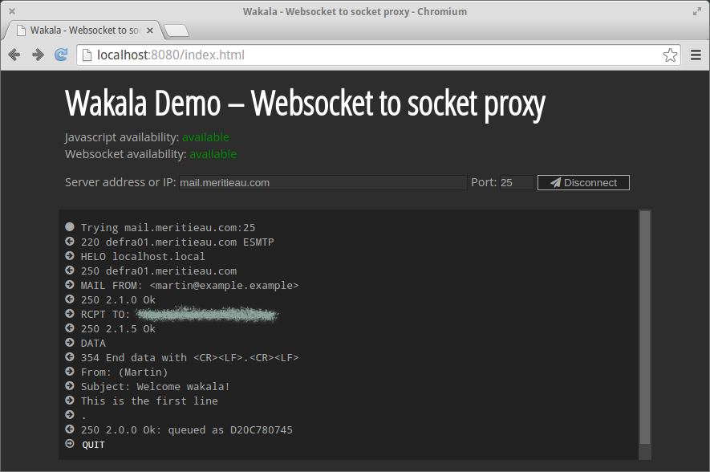

wakala example
==============
Using this example it is possible to connect to a raw port using a web
browser. The screenshot below shows how to connect to a smtp-server and
send an email.



Installation
------------

On a unix like system
=====================

```
./rebar get-deps compile
./start.sh
```
and point your browser to the returned URL.

On a windows like system
========================

```
rebar
start
```
and point your browser to the returned URL.


Acknowledgements
----------------
This proxy was easy to implement due to the excellent
[cowboy](https://github.com/ninenines/cowboy) server.


Contributing
------------
Anyone and everyone is welcome to [contribute](../CONTRIBUTING.md).


License
-------
This software is licensed under the [ISC License](../LICENSE).
